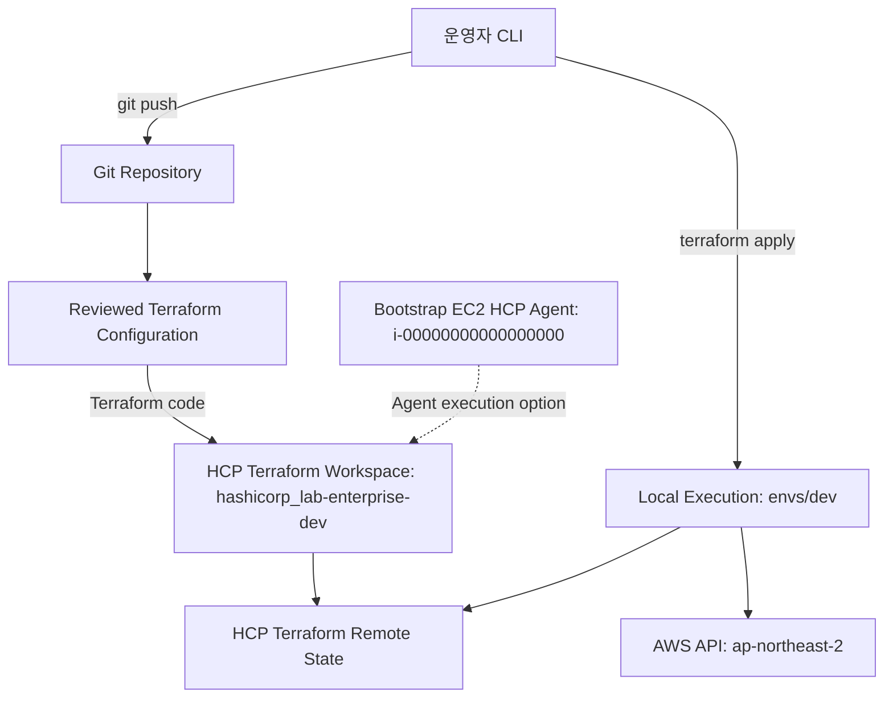
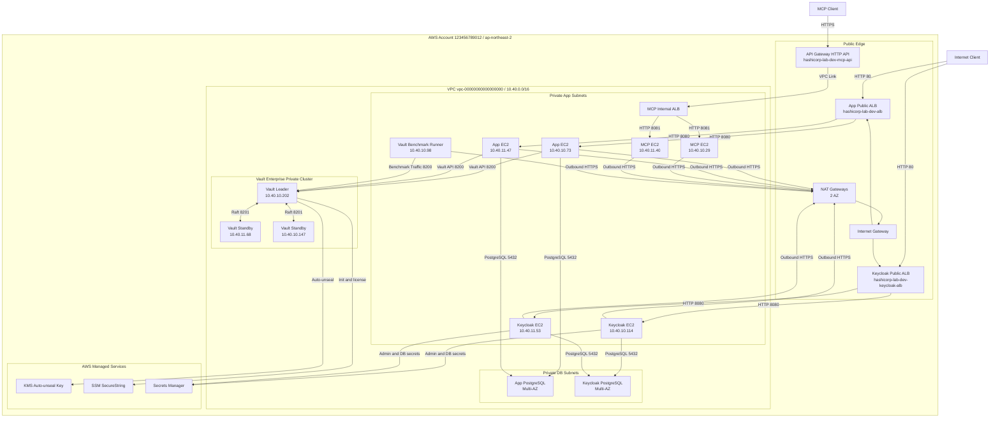
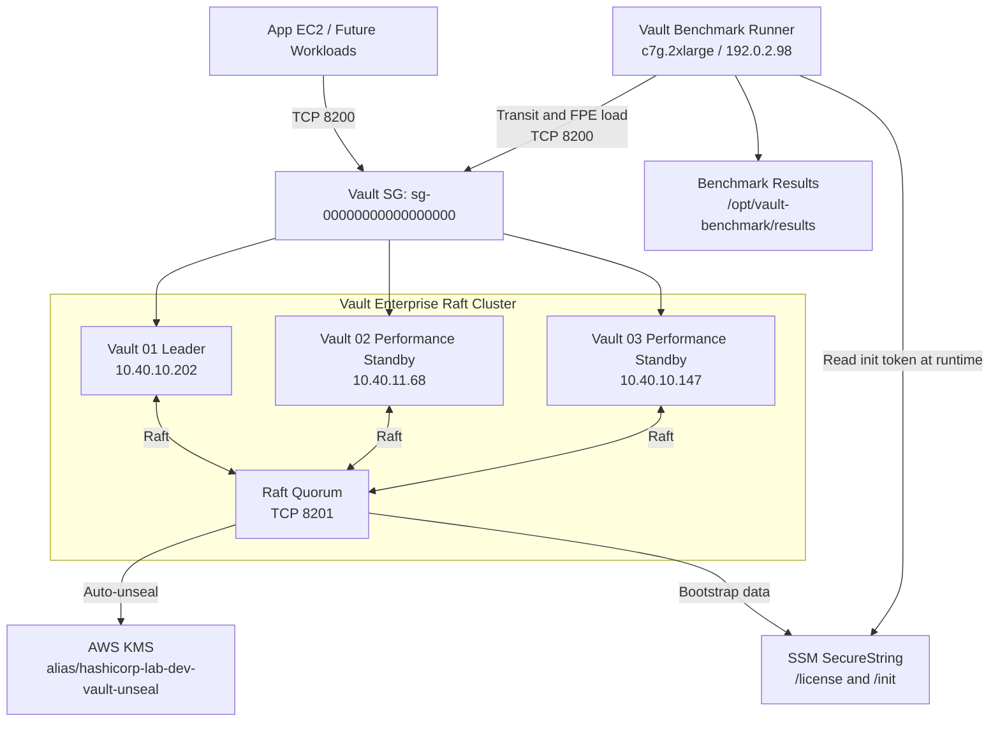
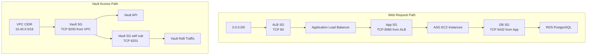
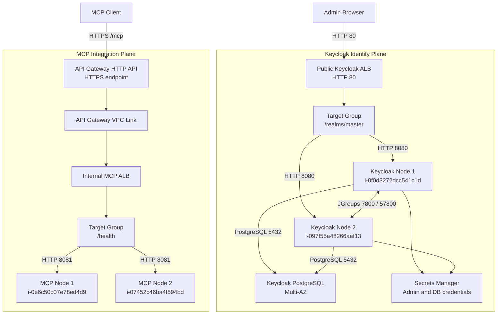
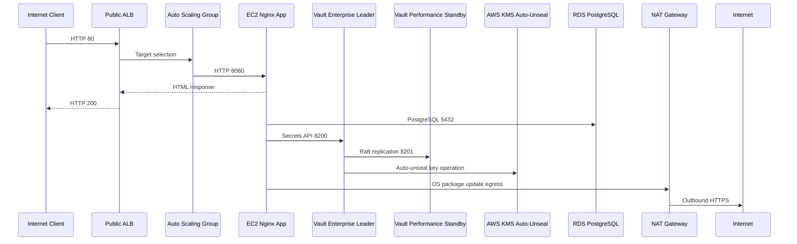

> 주소와 리소스 ID는 예시입니다. 실제 값은 배포 환경에 맞게 지정하세요.

# HashiCorp Enterprise AWS Lab 구성도

작성일: 2026-06-23

## 1. 전체 운영 흐름

## 2. AWS 전체 구성도

## 3. Vault Enterprise 상세 구성

## 4. 보안 그룹 관계

## 5. Keycloak 및 MCP/API Gateway 흐름

## 6. 요청 및 Vault 처리 흐름

## 7. 운영 메모

- Vault Enterprise는 3노드 Raft 클러스터로 초기화됨.
- Vault 리더는 `192.0.2.202`, standby는 `192.0.2.68`, `192.0.2.147`.
- Vault init 결과는 `/hashicorp-lab/dev/vault/init` SSM SecureString에 저장됨.
- `./private/vault.hclic`는 `2026-05-31` 만료라 기동 실패했고, 현재 SSM 라이선스 파라미터는 `vault_exp20260930.hclic` 내용으로 갱신됨.
- Keycloak은 2노드 EC2 ASG와 전용 PostgreSQL Multi-AZ RDS로 구성됨.
- MCP 서버는 2노드 EC2 ASG, 내부 ALB, API Gateway HTTP API VPC Link로 구성됨.
- Vault benchmark runner는 private subnet의 `c7g.2xlarge` 단일 EC2로 구성됨.
- ALB HTTP 응답 정상 확인됨.
- Keycloak `/realms/master`, MCP `/health`, MCP JSON-RPC `initialize` 응답 정상 확인됨.
- Vault Transit smoke benchmark와 Transform FPE smoke benchmark 정상 확인됨.
- RDS는 `available`, Multi-AZ 활성화 상태.
- 실습이 끝나면 `envs/dev`에서 `terraform destroy`로 비용 발생 리소스를 내려야 함.
