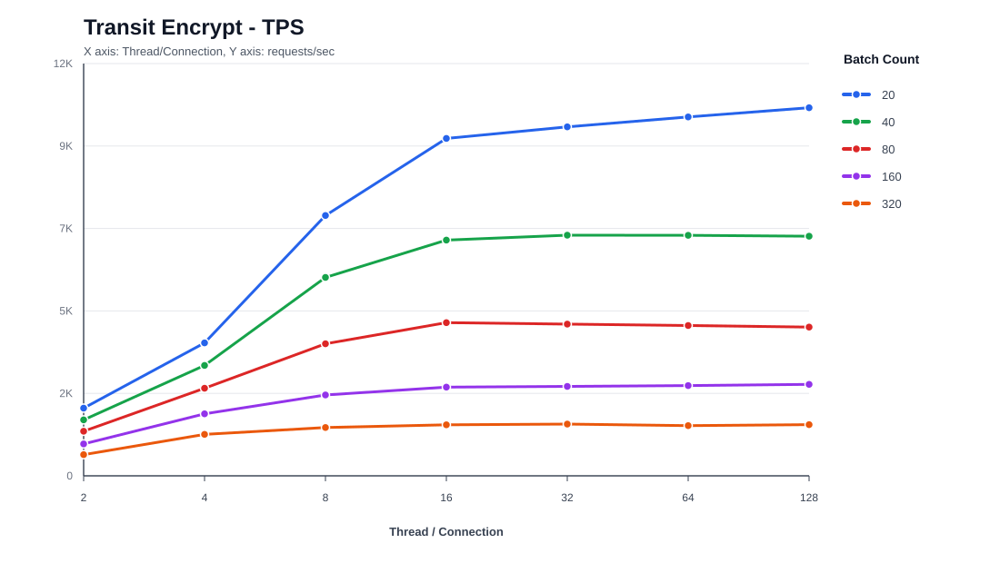
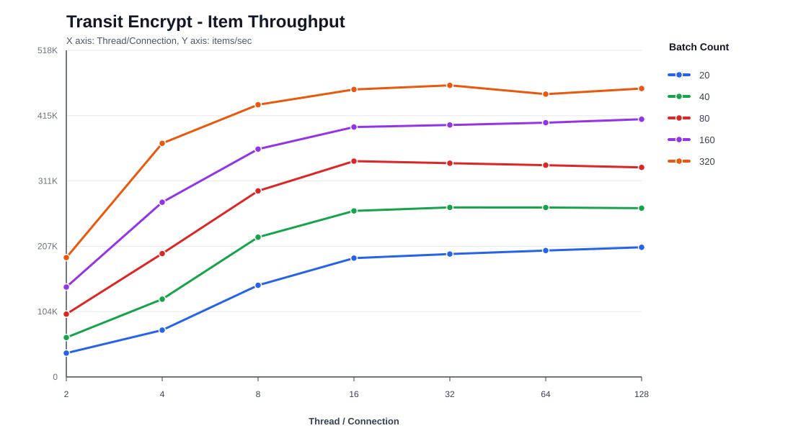
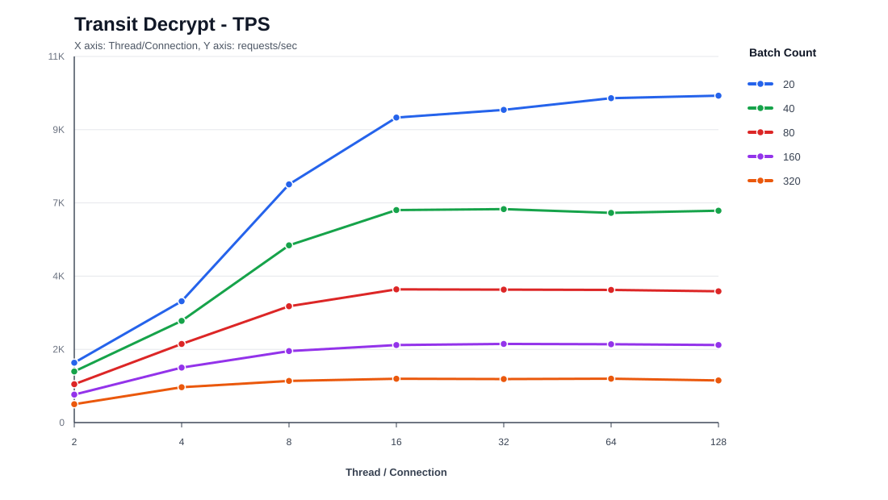
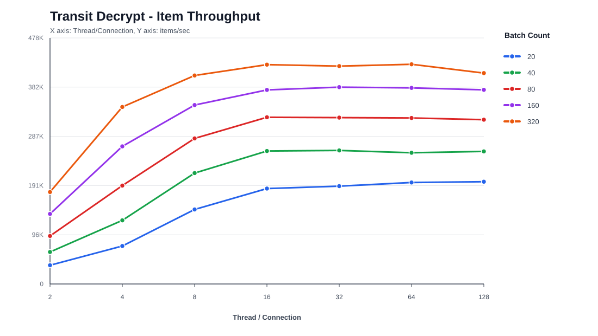
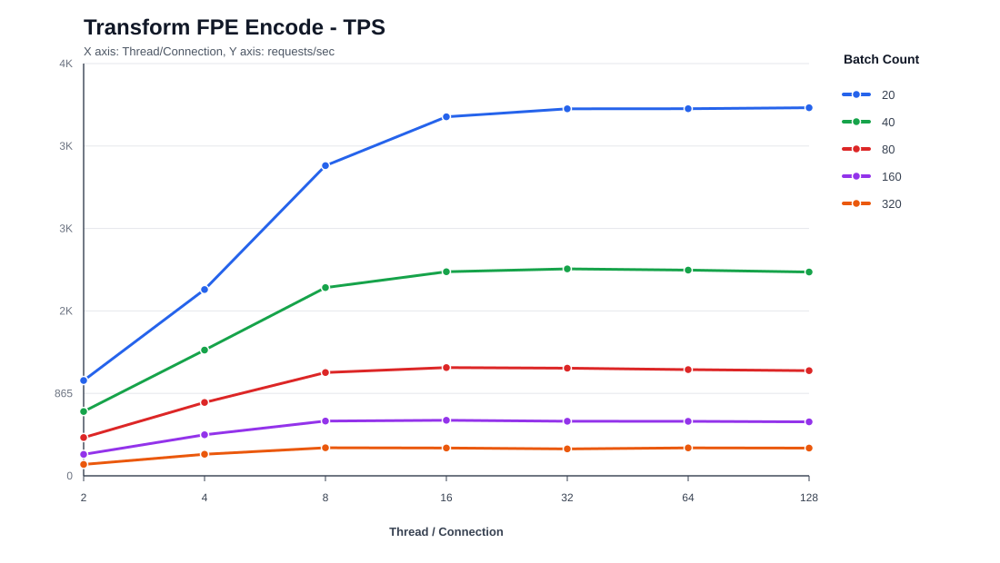
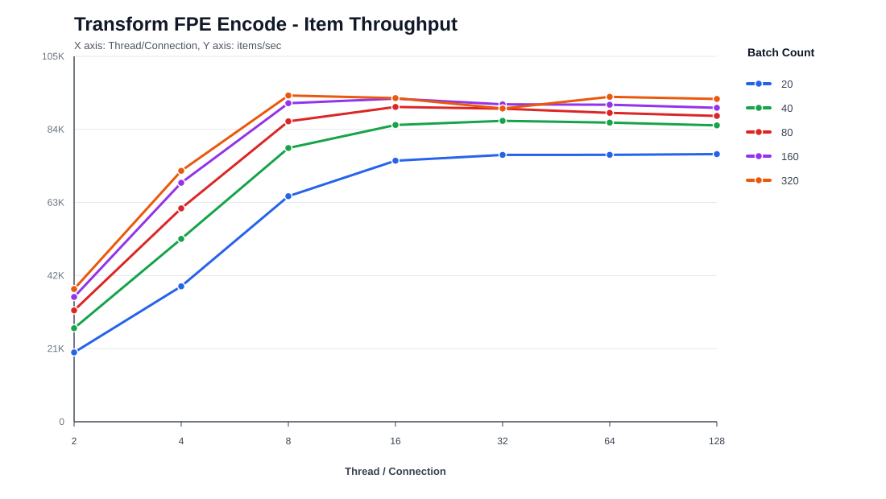

# Vault Benchmark 결과 보고서

작성일: 2026-06-23

## 1. 테스트 개요

| 항목 | 내용 |
| --- | --- |
| Vault Version | `2.0.3+ent` |
| Vault 구성 | 3-node integrated storage Raft cluster |
| Benchmark Runner | `c7g.2xlarge` |
| 테스트 도구 | `wrk`, `vault-benchmark`, Vault CLI |
| Matrix 테스트 시간 | 케이스별 5초 |
| 1000만 개 부하 기준 | `10,000,000`개 데이터 항목 누적 처리 |

이번 테스트는 Vault가 직접 API 요청을 받아 암호화/복호화를 수행하는 성능을 측정했다. 테스트 범위는 다음과 같다.

| 테스트 항목 | Vault 엔진 | 측정 의미 |
| --- | --- | --- |
| Transit Encrypt | Transit secrets engine | 일반 암호화 API 처리 성능 |
| Transit Decrypt | Transit secrets engine | 일반 복호화 API 처리 성능 |
| Transform FPE Encode | Transform secrets engine | 형태 보존 암호화 API 처리 성능 |

`1000만 개 부하`는 요청 1건에 1000만 개 데이터를 넣었다는 의미가 아니다. 요청 1건에 여러 개 데이터를 batch로 담고, 누적 처리 데이터가 `10,000,000`개 이상이 될 때까지 실행했다는 의미다.

## 2. 핵심 결과

| 구분 | 가장 높은 결과 | 쉽게 읽으면 |
| --- | --- | --- |
| Transit Encrypt API 요청 처리량 | batch 20, T/C 128, `10,286.19 requests/sec` | Vault가 초당 평균 `10,286.19`건의 암호화 API 요청을 처리했다. |
| Transit Decrypt API 요청 처리량 | batch 20, T/C 128, `9,932.21 requests/sec` | Vault가 초당 평균 `9,932.21`건의 복호화 API 요청을 처리했다. |
| Transform FPE Encode API 요청 처리량 | batch 20, T/C 128, `3,862.95 requests/sec` | Vault가 초당 평균 `3,862.95`건의 FPE Encode API 요청을 처리했다. |
| Transit Encrypt 데이터 처리량 | batch 320, T/C 32, `462,716.80 items/sec` | Vault가 초당 평균 `462,716.80`개의 평문 데이터를 암호화했다. |
| Transit Decrypt 데이터 처리량 | batch 320, T/C 64, `426,729.60 items/sec` | Vault가 초당 평균 `426,729.60`개의 암호문 데이터를 복호화했다. |
| Transform FPE Encode 데이터 처리량 | batch 320, T/C 8, `94,185.60 items/sec` | Vault가 초당 평균 `94,185.60`개의 카드번호 형식 데이터를 형태 보존 암호화했다. |

## 3. Transit Encrypt 결과

| 관점 | 조건 | 결과 | 해석 |
| --- | --- | ---: | --- |
| API 요청 처리량 | batch 20, T/C 128 | `10,286.19 requests/sec` | Vault가 초당 평균 `10,286.19`건의 Transit Encrypt API 요청을 처리했다. |
| 실제 데이터 처리량 | batch 320, T/C 32 | `462,716.80 items/sec` | Vault가 초당 평균 `462,716.80`개의 평문 데이터를 암호화했다. |

`requests/sec`는 Vault API 요청 처리량이고, `items/sec`는 실제 데이터 처리량이다. 예를 들어 batch 20 조건에서 `10,286.19 requests/sec`가 나왔다는 것은 Vault가 초당 평균 `10,286.19`건의 API 요청을 처리했다는 뜻이다. 이때 요청 1건에 데이터 20개가 들어 있으므로 실제 데이터 처리량은 초당 `205,723.80`개다.

## 4. Transit Decrypt 결과

| 관점 | 조건 | 결과 | 해석 |
| --- | --- | ---: | --- |
| API 요청 처리량 | batch 20, T/C 128 | `9,932.21 requests/sec` | Vault가 초당 평균 `9,932.21`건의 Transit Decrypt API 요청을 처리했다. |
| 실제 데이터 처리량 | batch 320, T/C 64 | `426,729.60 items/sec` | Vault가 초당 평균 `426,729.60`개의 암호문 데이터를 복호화했다. |

복호화도 암호화와 동일하게 API 요청 건수와 실제 데이터 처리량을 나누어 해석해야 한다. batch 20 조건에서는 API 요청 처리량이 높고, batch 320 조건에서는 실제 데이터 처리량이 높게 관측됐다.

## 5. Transform FPE Encode 결과

| 관점 | 조건 | 결과 | 해석 |
| --- | --- | ---: | --- |
| API 요청 처리량 | batch 20, T/C 128 | `3,862.95 requests/sec` | Vault가 초당 평균 `3,862.95`건의 Transform FPE Encode API 요청을 처리했다. |
| 실제 데이터 처리량 | batch 320, T/C 8 | `94,185.60 items/sec` | Vault가 초당 평균 `94,185.60`개의 카드번호 형식 데이터를 형태 보존 암호화했다. |

Transform FPE Encode는 원본 데이터의 형식과 길이를 유지하면서 암호화하는 방식이다. 예를 들어 16자리 숫자 형식을 유지해야 하는 데이터에 사용할 수 있다. 일반 Transit 암호화보다 연산 비용이 높기 때문에 처리량은 Transit Encrypt/Decrypt보다 낮게 관측됐다.

## 6. 1000만 개 부하 처리 결과

1000만 개 부하 테스트는 `Batch Count = 320`, `Threads = 128`, `Connections = 128`, `Chunk Duration = 20s` 조건으로 수행했다.

| Scenario | Total Requests | Total Items | Chunks | Avg Requests/sec | Avg Items/sec |
| --- | ---: | ---: | ---: | ---: | ---: |
| Transit Encrypt | 57,809 | 18,498,880 | 2 | 1,437.98 | 460,153.60 |
| Transform FPE Encode | 35,563 | 11,380,160 | 6 | 294.87 | 94,358.93 |

해석:

- Transit Encrypt 테스트에서 Vault는 총 `57,809`건의 API 요청을 처리했고, 요청 1건당 320개씩 총 `18,498,880`개의 데이터를 암호화했다.
- Transform FPE Encode 테스트에서 Vault는 총 `35,563`건의 API 요청을 처리했고, 요청 1건당 320개씩 총 `11,380,160`개의 데이터를 형태 보존 암호화했다.
- 두 테스트 모두 목표였던 `10,000,000`개 이상 처리 조건을 만족했다.
- 결과가 정확히 `10,000,000`에서 멈추지 않고 더 크게 나온 이유는 20초 chunk가 끝날 때까지 실행한 뒤 누적 개수를 계산했기 때문이다.

## 7. 테스트 후 상태

| 항목 | 결과 |
| --- | --- |
| Vault Sealed | `false` |
| HA Mode | `active` |
| Raft Peer Status | `3 voters` |
| Post-test Check | Vault cluster remained initialized, unsealed, and active after benchmark. |

부하 테스트 후에도 Vault 클러스터는 정상 상태를 유지했다. 테스트 범위 안에서는 benchmark 실행으로 인해 Vault가 seal되거나 Raft 구성이 깨지는 현상은 없었다.

## 8. CPU 참고 지표

| 구성 요소 | Avg CPU | Max CPU |
| --- | ---: | ---: |
| Vault leader | 21.71% | 84.60% |
| Vault follower 1 | 0.90% | 1.70% |
| Vault follower 2 | 0.86% | 1.04% |
| Benchmark runner | 2.45% | 21.75% |

이번 테스트는 Vault leader endpoint로 직접 부하를 넣은 결과다. 따라서 leader CPU 사용률이 가장 높고 follower CPU는 낮게 관측됐다. 실제 운영 구성에서 load balancer, audit device, client routing 정책이 달라지면 CPU 분포도 달라질 수 있다.

## 9. 최종 해석

- API 요청 건수 기준으로는 작은 Batch Count에서 가장 높은 값이 나왔다.
- 실제 데이터 처리량 기준으로는 큰 Batch Count에서 더 높은 값이 나왔다.
- Transit Encrypt/Decrypt는 대량 batch 처리 기준으로 초당 약 `42만~46만`개 데이터 항목 처리량이 관측됐다.
- Transform FPE Encode는 대량 batch 처리 기준으로 초당 약 `9만`개 데이터 항목 처리량이 관측됐다.
- Transform FPE Encode는 형식 보존 암호화 특성상 Transit Encrypt/Decrypt보다 처리량이 낮게 관측됐다.
- 본 결과는 Vault API가 직접 데이터를 암호화/복호화하는 방식의 테스트다. Transit datakey를 받아 외부 애플리케이션에서 직접 암호화하는 in-place 방식의 성능은 별도 테스트가 필요하다.
