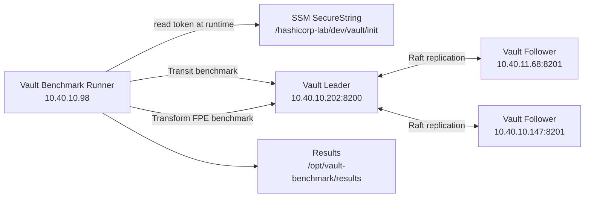

> 주소와 리소스 ID는 예시입니다. 실제 값은 배포 환경에 맞게 지정하세요.

# Vault Benchmark

작성일: 2026-06-23

## 대상 구성

```text
Vault version:      2.0.3+ent
Vault topology:     3-node integrated storage Raft cluster
Vault leader:       i-00000000000000000 / 192.0.2.202
Vault standbys:     i-00000000000000000 / 192.0.2.68, i-00000000000000000 / 192.0.2.147
Benchmark runner:   i-00000000000000000 / 192.0.2.98 / c7g.2xlarge
Benchmark tools:    vault-benchmark, wrk
Vault target:       http://192.0.2.202:8200
```

## 실행 구조



## Smoke 결과

PDF 스타일 matrix 및 1000만 개 부하 테스트 결과는 `docs/vault-benchmark-test-result-2026-06-23.md`에 정리되어 있다.

### Transit encrypt/decrypt

```text
Command:      DURATION=10s run-vault-benchmark transit-smoke
Result dir:   /opt/vault-benchmark/results/20260623T083716Z-transit-smoke
Target:       http://192.0.2.202:8200
```

| Operation | Count | Rate | Throughput | Mean | P95 | P99 | Success |
| --- | ---: | ---: | ---: | ---: | ---: | ---: | ---: |
| decrypt_payload_128 | 53,700 | 5,370.08/sec | 5,369.59/sec | 921.809 us | 1.116 ms | 1.371 ms | 100.00% |
| encrypt_payload_128 | 53,625 | 5,362.50/sec | 5,362.00/sec | 931.106 us | 1.118 ms | 1.385 ms | 100.00% |

### Transform FPE encode

```text
Commands:
  prepare-transform-fpe
  THREADS=2 CONNECTIONS=2 CARD_COUNT=20 DURATION=10s run-transform-fpe-wrk
Result dir: /opt/vault-benchmark/results/20260623T083745Z-transform-fpe-20cards-t2-c2
Target:     http://192.0.2.202:8200
```

| Scenario | Threads | Connections | Card Count | Duration | Requests | Requests/sec | Avg Latency | Max Latency |
| --- | ---: | ---: | ---: | ---: | ---: | ---: | ---: | ---: |
| Transform FPE encode | 2 | 2 | 20 | 10s | 21,895 | 2,167.87 | 0.92 ms | 5.22 ms |

## 실행 명령

SSM 접속:

```bash
aws ssm start-session \
  --region ap-northeast-2 \
  --target i-00000000000000000
```

Vault 상태 확인:

```bash
vault-benchmark-status
```

Transit smoke:

```bash
DURATION=10s run-vault-benchmark transit-smoke
```

Transit 1분 테스트:

```bash
run-vault-benchmark transit-encrypt-only
run-vault-benchmark transit-decrypt-only
```

Transform FPE 단일 테스트:

```bash
prepare-transform-fpe
THREADS=2 CONNECTIONS=2 CARD_COUNT=20 DURATION=30s run-transform-fpe-wrk
```

PDF 스타일 Transform FPE matrix:

```bash
DURATION=60s run-transform-fpe-matrix
```

## 주의사항

- 전체 matrix는 Vault에 강한 부하를 주므로 실습 시간과 비용을 정한 뒤 실행한다.
- runner는 Vault root token을 SSM SecureString에서 런타임에 읽는다. 토큰 값을 터미널이나 문서에 남기지 않는다.
- `t4g.2xlarge`는 burstable 인스턴스라 장시간 성능 테스트에서는 CPU credit 영향을 받을 수 있다.
- 고객 제출용 결과는 각 테스트 전후의 Vault CPU, 메모리, Raft 상태, CloudWatch 지표를 함께 캡처한다.
